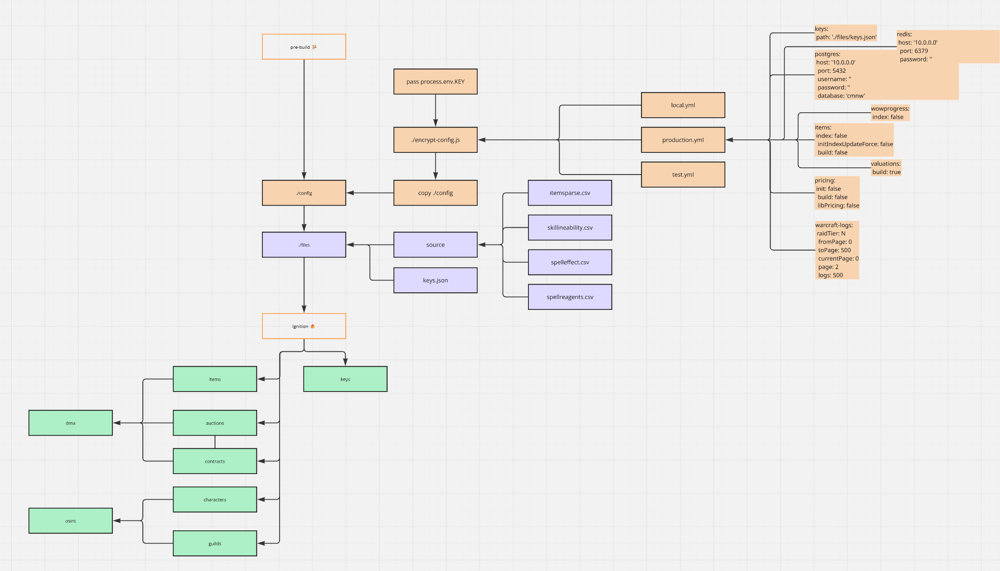
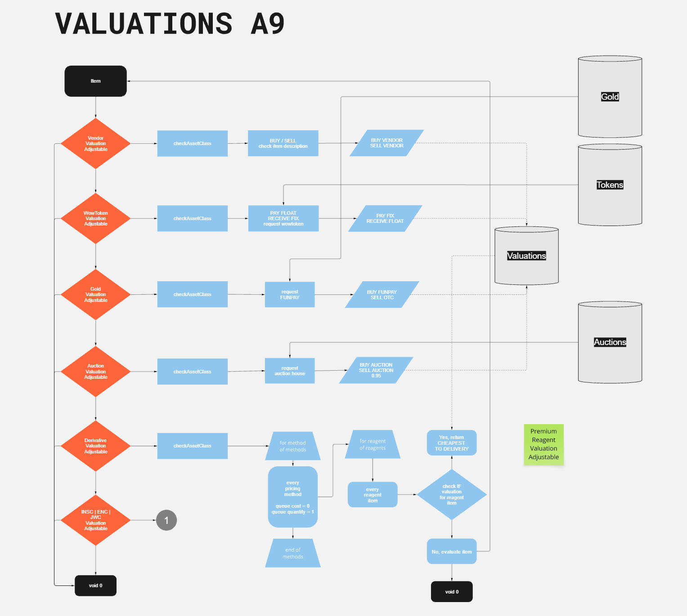

  

# CMNW

Welcome to [CMNW](https://cmnw.me/)

## Technology

CMNW is a set of separate microservices, build with [NestJs](https://nestjs.com) framework. Using PostgreSQL & MongoDB as storage. And Rabbit & BullMQ for disturbed job queue.

## Ignition

## Deploy

Deployment is available via GitHub action & control panel.

1. Get secrets & envs from `./???????`
2. `.env` & `.env.docker`
3. Pass `.env.docker` as BUILD ARG
4. Deploy *ENC* password

## Valuations 

Pricing engine schema, for valuation-calculations based on XVA model.

## Tests

Written with [Jest.js](https://jestjs.io) library, and may be found in `test` [folder](https://github.com/alexzedim/cmnw/blob/master/apps/tests) of current repository.
- [test suite](https://github.com/AlexZeDim/cmnw/blob/master/apps/tests/test/tests.osint.spec.ts) and [osint.mocks](https://github.com/AlexZeDim/cmnw/blob/master/apps/tests/mocks/osint.mock.ts) for OSINT area
- [test suite](https://github.com/AlexZeDim/cmnw/blob/master/apps/tests/test/tests.dma.spec.ts) and [dma.mocks](https://github.com/AlexZeDim/cmnw/blob/master/apps/tests/mocks/dma.mock.ts) for DMA area

## Contribution

You will be welcome and glad to receive any kind of contribution or feedback.  are experienced in the relative field. Code reviewing, component design ideas, issues & pull requests are opened.
